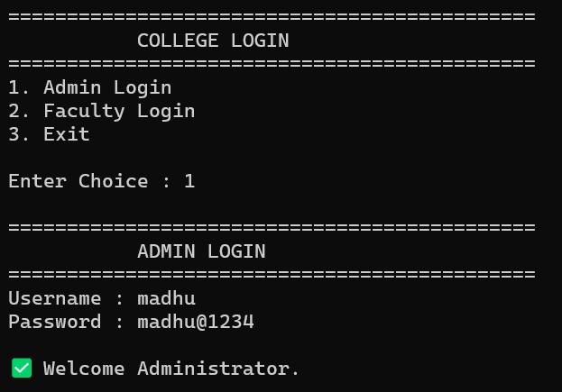
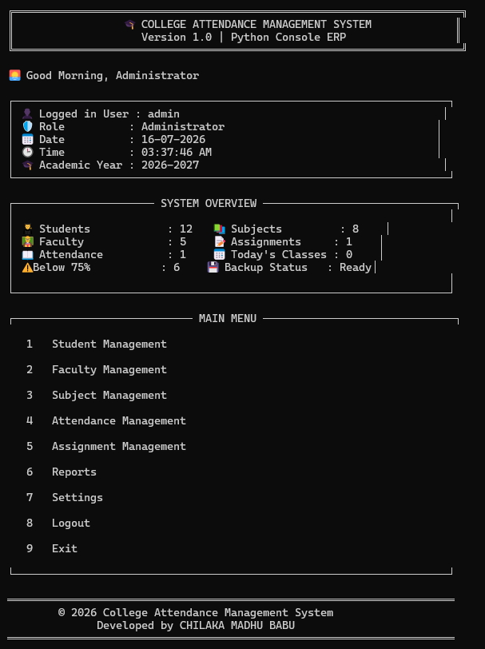
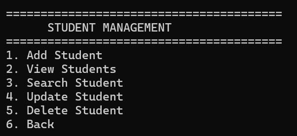
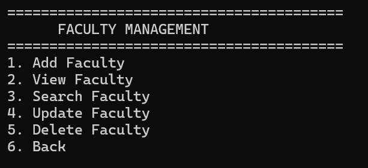
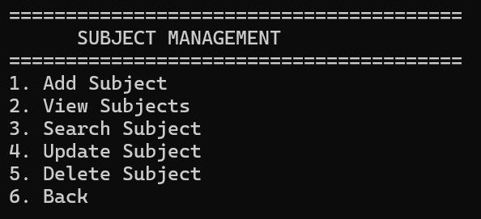
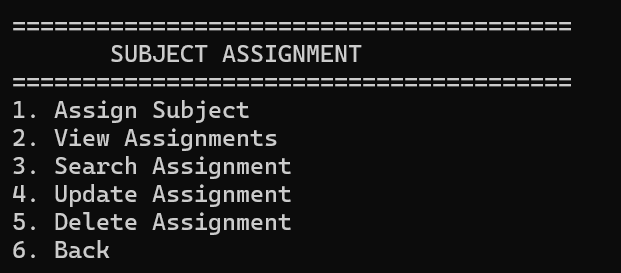
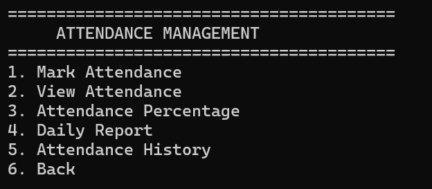
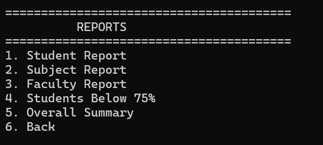
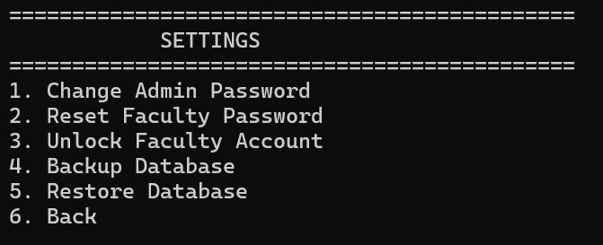
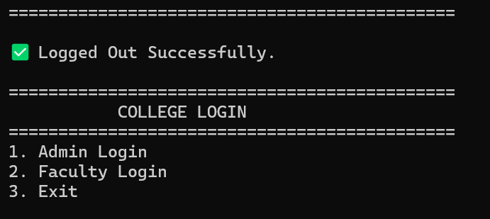

# 🎓 College Attendance Management System

<div align="center">


A Professional Console-Based College Attendance Management System developed using **Python** and **JSON Database**.

</div>

---

# 📖 Overview

The **College Attendance Management System** is a role-based console application developed in Python to simplify attendance management in educational institutions.

The system allows administrators to manage students, faculty members, subjects, assignments, attendance records, reports, and system settings while faculty members can securely mark attendance and access their assigned classes.

The project follows a modular architecture with authentication, validation, activity logging, backup & restore functionality, and comprehensive reporting.

---

# ✨ Features

## 🔐 Authentication

- Secure Admin Login
- Secure Faculty Login
- Role-Based Access Control
- Change Password
- Password Reset
- Account Locking
- Unlock Faculty Account

---

## 👨‍🎓 Student Management

- Add Student
- View Students
- Search Student
- Update Student
- Delete Student
- Auto Student ID Generation
- Input Validation

---

## 👨‍🏫 Faculty Management

- Add Faculty
- View Faculty
- Search Faculty
- Update Faculty
- Delete Faculty
- Auto Faculty ID Generation
- Email Validation
- Phone Validation

---

## 📚 Subject Management

- Add Subject
- View Subjects
- Search Subject
- Update Subject
- Delete Subject
- Credits Validation
- Subject Code Validation

---

## 📝 Subject Assignment

- Assign Subject to Faculty
- View Assignments
- Search Assignment
- Update Assignment
- Delete Assignment
- Duplicate Assignment Prevention

---

## 📖 Attendance Management

- Faculty Attendance
- Mark Attendance
- View Attendance
- Attendance Percentage
- Daily Attendance Report
- Attendance History
- Duplicate Attendance Prevention

---

## 📊 Reports

- Student Attendance Report
- Faculty Report
- Subject Report
- Students Below 75%
- Overall Summary

---

## ⚙️ Settings

- Change Admin Password
- Reset Faculty Password
- Unlock Faculty Account
- Backup Database
- Restore Database

---

## 📁 Activity Logging

- Login History
- Logout History
- Student Operations
- Faculty Operations
- Subject Operations
- Assignment Operations
- Attendance Logs
- Settings Logs

---

## 🛡️ Data Validation

- Name Validation
- Email Validation
- Phone Validation
- Password Validation
- Subject Code Validation
- Credits Validation
- Duplicate Record Prevention

---

## 🔒 Data Integrity

- Prevent deleting students with attendance records
- Prevent deleting faculty assigned to subjects
- Prevent deleting assigned subjects
- Prevent deleting assignments with attendance history

---

# 📸 Screenshots

## 🔐 Login Screen



---

## 🏠 Admin Dashboard



---

## 👨‍🎓 Student Management



---

## 👨‍🏫 Faculty Management



---

## 📚 Subject Management



---

## 📝 Assignment Management



---

## 📖 Attendance Management



---

## 📊 Reports



---

## ⚙️ Settings



---

## 📁 Activity Logger



---

# 🏗️ Project Structure

```
Attendance_Management_System
│
├── backups/
│
├── database/
│   ├── attendance.json
│   ├── assignments.json
│   ├── auth.json
│   ├── faculty.json
│   ├── students.json
│   ├── subjects.json
│   └── database_manager.py
│
├── logs/
│   └── activity.log
│
├── modules/
│   ├── assignment.py
│   ├── attendance.py
│   ├── auth.py
│   ├── dashboard.py
│   ├── faculty.py
│   ├── reports.py
│   ├── settings.py
│   ├── student.py
│   └── subject.py
│
├── panels/
│   ├── admin_panel.py
│   └── faculty_panel.py
│
├── screenshots/
│
├── utils/
│   ├── helpers.py
│   ├── id_generator.py
│   ├── logger.py
│   ├── menu.py
│   ├── splash.py
│   └── validator.py
│
├── README.md
├── LICENSE
├── main.py
└── requirements.txt
```

---

# 💻 Technologies Used

- Python 3
- JSON Database
- File Handling
- Object-Oriented Programming
- Modular Programming
- Exception Handling
- Git
- GitHub

---

# 🚀 Installation

Clone the repository

```bash
git clone https://github.com/YOUR_USERNAME/Attendance_Management_System.git
```

Go to the project folder

```bash
cd Attendance_Management_System
```

Run the project

```bash
python main.py
```

---

# 🔑 Default Login Credentials

## 👨‍💼 Administrator

```
Username : admin
Password : admin@123
```

---

## 👨‍🏫 Faculty

```
Username : FAC001
Password : FAC001@123
```

> **Note:** Faculty accounts are required to change the temporary password on first login.

---

# 📈 Project Highlights

- ✔ Modular Architecture
- ✔ Role-Based Authentication
- ✔ Auto ID Generation
- ✔ Attendance Analytics
- ✔ Dashboard Statistics
- ✔ Activity Logger
- ✔ Backup & Restore
- ✔ Input Validation
- ✔ Exception Handling
- ✔ Data Integrity Checks
- ✔ Professional Console Interface

---

# 🔮 Future Enhancements

- Flask Web Application
- React Frontend
- MySQL Database
- QR Code Attendance
- Face Recognition Attendance
- Email Notifications
- SMS Notifications
- Cloud Deployment
- REST API Integration
- Mobile Application

---

# 👨‍💻 Author

**Ch Madhu Babu**

B.Tech – Computer Science Engineering (AI & ML)

CMR Engineering College

GitHub: https://github.com/madhuchilaka

---

# 📜 License

---

## © Copyright

Copyright © 2026 CH Madhu Babu.

This project is licensed under the MIT License. See the LICENSE file for details.


# ⭐ Support

If you found this project useful:

⭐ Star this repository

🍴 Fork the repository

📢 Share it with others

---

<div align="center">

### 🎓 Thank you for visiting this repository.

Made with ❤️ using Python.

</div>